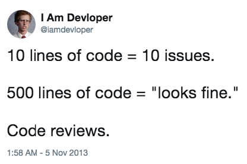
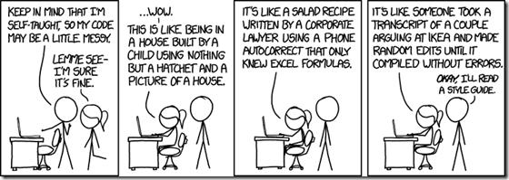
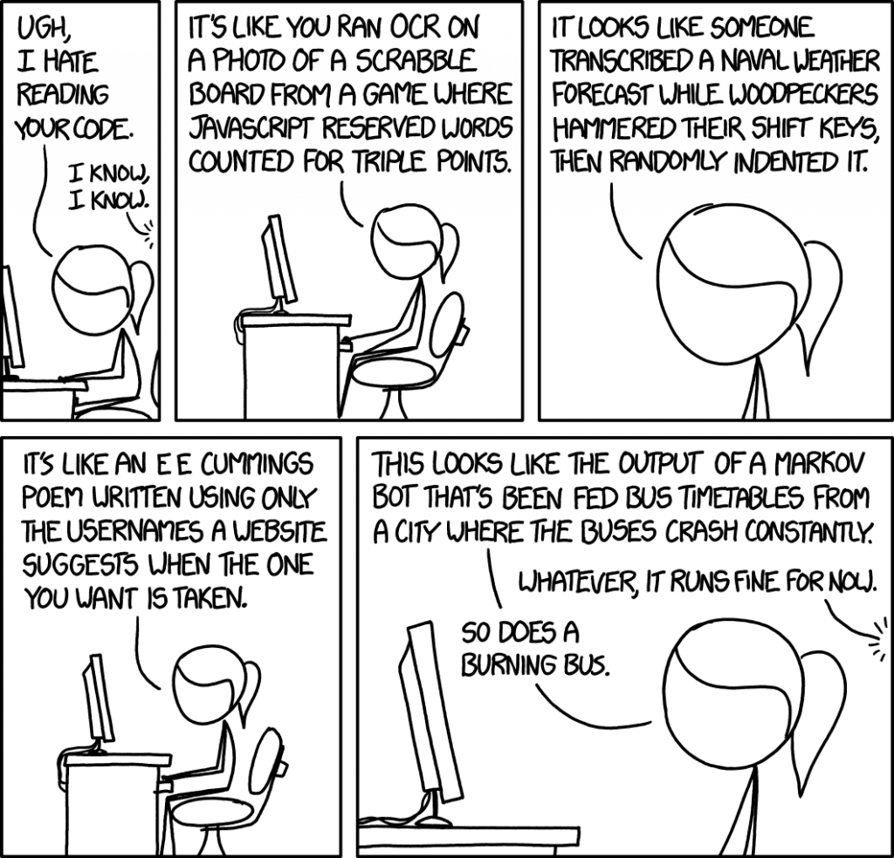

```{r setup, include=FALSE}
knitr::opts_chunk$set(echo = TRUE)
```

# What is a code review?

Code reviews are meetings where peers gather to review a program to ensure its quality. 

## What makes for a good code review?
  * The meeting includes the code's authors and at least one outside reviewer.
  * The code under review should not be broken.
    + Fix the obvious bugs beforehand, and make sure your script compiles/sources without errors.
  * The review should focus on 200-400 lines of code. Any more or less, and the review becomes too trivial or too overwhelming.
    + Repetitive code may be easier to review, so this limit is flexible. However, writing repetitive code is not generally good programming practice anyway!
  * Thorough code reviews usually require 1 hour for every 300 lines of code.
  
  {width=40%}
  
## What elements of the code should I focus on?
  * Human Readability
    + Does the code use meaningful variable names?
    + Does the code adhere to the preferred [style guide](https://style.tidyverse.org/)?
    + Are the comments sufficient to allow a reasonably fluent outside programmer to tell what's going on?
    + If the author unexpectedly left the lab group tomorrow, what parts of the code would be unusable?
  * Efficiency
    + Does the [code smell](https://en.wikipedia.org/wiki/Code_smell)?
    + Is it too repetitive?
    + Does it require outdated packages or functions?
  * Logical completeness
    + Does the code actually do what the author thinks it is doing?
    + Are there any errors or typos that would affect the results?
  * For our lab group specifically: are the statistical methods appropriate?
  
  {width=70%}
  
# Why do code reviews matter? Are really they worth the time and energy?  
Yes, code reviews are worth the investment because:

  * They are learning opportunities
    + Whether you're the author or reviewer, you may come across a new or better way of doing things!
  * They improve accountability
    + You're more likely to style and format your code if you know it won't stay hidden forever
  * They help prevent catastrophic errors
    + Like [this](https://besjournals.onlinelibrary.wiley.com/doi/abs/10.1111/1365-2745.13290?campaign=wolearlyview)
    
  {width=40%}

  

